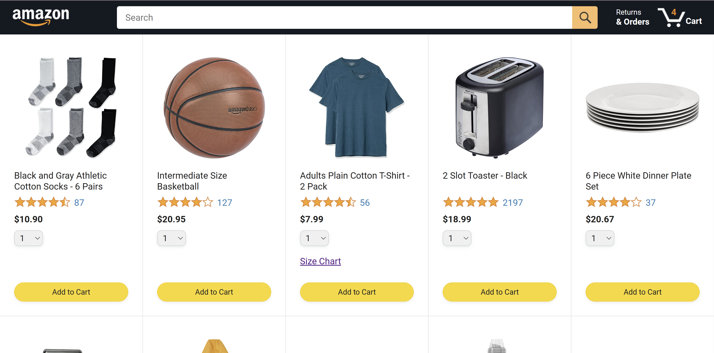
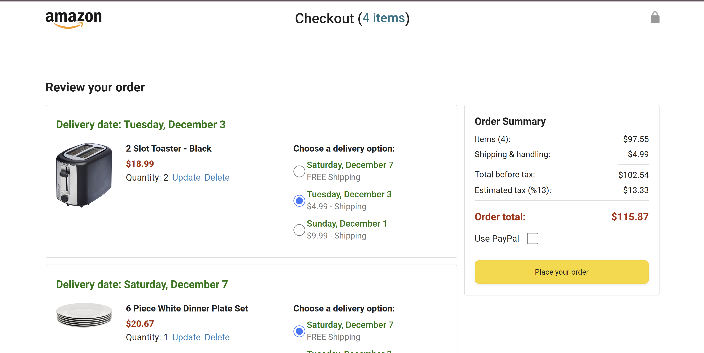
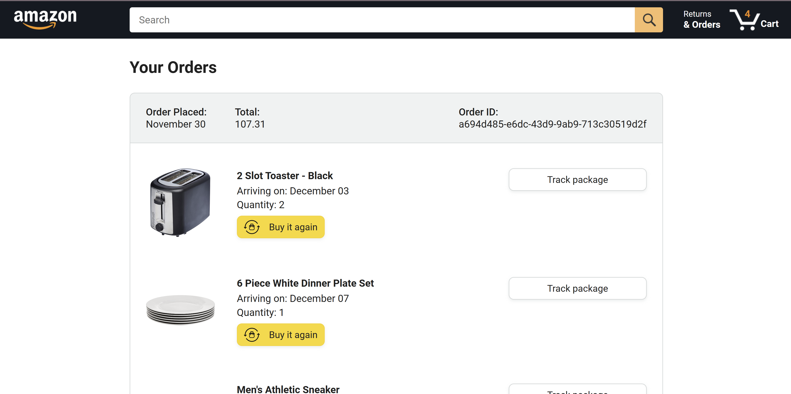
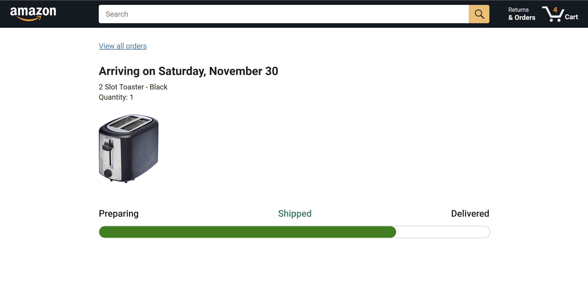

<h2>Amazon Replica Project</h2>

In this project, I set out to replicate Amazon's functionality using only JavaScript, HTML, and CSS. 

Working on this project was a truly enjoyable experience!

Below are some screenshots showcasing the project:

    
    
    
    

 
To try out the project, simply download the files and open one of the HTML files in your preferred browser. For the best experience, I recommend using VS Code with the Live Server extension, but feel free to use any method you like!
